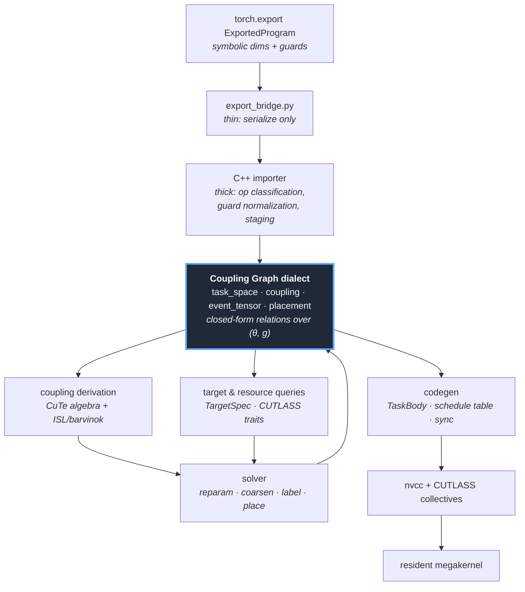

# TileMega

A megakernel puts an entire model inside one persistently resident kernel,
replacing kernel boundaries with in-kernel event synchronization. That removes
launch overhead and makes tile-level overlap across operators possible: the
first tiles of a consumer can start as soon as the specific producer tiles they
read are ready, rather than after the producer's last tile.

The hard part is deciding *how* to cut the work — how many tasks, at what tile
granularity, with events at which granularity, and which CTA owns which
communication. Existing megakernel systems take these as **inputs**: MPK's
per-layer API requires the user to pass `grid_dim` (a hardcoded constant in its
demo), and ETC requires the partition and event graph to be supplied through a
kernel DSL or compiler builtin. The reason is representational. Their dependence
information is an **enumerated edge set** — once built it is a concrete data
structure bound to specific shapes and a specific granularity. It cannot carry a
cost model, and it cannot be reused when the granularity changes.

TileMega's premise is that the dependence relation should instead be **closed
form and parameterized**. The Coupling Graph carries, for each producer-consumer
pair, an exact symbolic relation over the symbolic shape vector `θ` (from
`torch.export`'s `ShapeEnv`) and the granularity `g`. Task count, event count,
synchronization cost, wave quantization and communication volume then stop being
measurements of a fixed graph and become closed-form functions of `(θ, g)`.
Choosing a partition becomes a constructible, solvable problem rather than a
tuned constant.

This is enforced, not merely intended. The invariant is that the coupling
relation is a closed-form expression of `(θ, g)`, so changing `g` is a
**reparameterization rather than a re-derivation**. The MLIR attributes carry the
symbolic types themselves — a closed-form attribute stores the expression, a
coupling-map attribute stores the structured relation — so a pass that collapses
a relation to a scalar or a string cannot round-trip, and the verifier rejects it.



The Coupling Graph is the single contract between every layer: the frontend
constructs it, analysis fills it in, the solver optimizes over it, codegen walks
it, and every term of the cost model is one of its derived quantities. There is
deliberately no parallel in-memory representation to bypass it.

Four principles shape the rest of the design:

- **The analysis layer decides task boundaries and relations, never task
  interiors.** Access relations, dependence relations, parameterized integer
  sets, cardinality counting and cost modeling belong to the analysis layer. MMA
  shape, TMA, warp specialization, shared-memory swizzle and software pipelining
  belong to CUTLASS collectives.
- **The solver must be able to ask the backend what things cost.** CUTLASS
  answers at two levels: compile-time traits such as
  `sizeof(Collective::SharedStorage)` and `Collective::is_valid()`, which are
  free because they are template evaluation, and real compilation via
  `ptxas -v`. Pruning runs on traits; only surviving candidates are compiled.
- **CuTe is the representation, ISL is the solver.** CuTe layout algebra is what
  the IR carries and what the backend renders directly; ISL and barvinok handle
  set-valued relations, cardinality, symbolic shapes, piecewise and ragged
  domains, and closed-form cost.
- **Correctness is a ladder, each level differentially tested against the one
  below it.** L0 multi-kernel eager execution is the gold standard; L0.5 is a
  host-side stage loop that exercises the compilation pipeline without in-kernel
  synchronization; L1 is a single kernel with a global barrier per stage —
  correct but with zero overlap; L2 through L4 add per-edge events, event
  coarsening with granularity optimization, and symbolic-shape variant
  selection. Every level stays switchable for differential comparison.

Portability is expressed as capability switches rather than an ordering on
architecture numbers, because that ordering is false: sm_120 has no tcgen05
even though tcgen05 exists on sm_100. One architecture-neutral source compiles
for sm_80, sm_89, sm_90 and sm_120, with per-target resource budgets — shared
memory differs by roughly a factor of two between datacenter and consumer parts,
which directly sets the pipeline stage count — read from checked-in target
descriptions rather than baked into the code.

Codegen through L1 is implemented and generates the megakernel from the dialect;
coupling derivation and the production solver are the next phases. The status
table in `TileMega_skeleton.md` section 1.5 is the authoritative record.

## Dependencies

| Dependency | Version | Notes |
| --- | --- | --- |
| C++ compiler | C++17 | |
| CMake | 3.22 or newer | |
| Ninja | any | generator used throughout |
| CUDA Toolkit | provides `nvcc` | required; `sm_80/89/90/120` targets |
| LLVM/MLIR | pinned commit `23a60f15f2fcafcf67b95b0a035053579958b732` (`23.0.0git`) | **required** — the CG dialect is the mandatory L4-to-L1 contract, so `TILEMEGA_ENABLE_MLIR=OFF` is rejected |
| CUTLASS | `third_party/cutlass` submodule | task interiors and collectives |
| Python | 3.8 or newer | `lit` driver, export bridge |
| PyTorch | 2.x | only for the `torch.export` bridge, not for building the compiler |
| barvinok | `third_party/barvinok` submodule | recorded for Phase 3 polyhedral work; **not built** |
| ISL | — | disabled until Phase 3 (`TILEMEGA_ENABLE_ISL=OFF`) |

MLIR must come from an **install tree**. A build tree's CMake package bakes
absolute paths to both the build and source directories and breaks as soon as
either moves; an install tree computes its paths relative to the config file and
survives being relocated. `scripts/build_mlir.sh` builds the pinned commit and
installs it; `docs/BUILD_MLIR.md` covers the details, including how to recover a
build tree that has already been moved.

## Build

```bash
git submodule update --init --recursive

# Build and install the pinned LLVM/MLIR (once).
scripts/build_mlir.sh /path/to/prefix

cmake -S . -B build -G Ninja -DMLIR_DIR=/path/to/prefix/lib/cmake/mlir
ninja -C build
ctest --test-dir build --output-on-failure
```

CMake options:

| Option | Default | Meaning |
| --- | --- | --- |
| `TILEMEGA_BUILD_TESTS` | `ON` | unit tests and the CG dialect `lit` suite |
| `TILEMEGA_BUILD_VERIFY` | `ON` | verification experiments, including `crosscompile-matrix` |
| `TILEMEGA_ENABLE_MLIR` | `ON` | required; `OFF` is rejected with an error |
| `TILEMEGA_ENABLE_ISL` | `OFF` | Phase 3 |
| `TILEMEGA_TARGET_ARCH` | `auto` | `auto`, `sm_80`, `sm_89`, `sm_90`, `sm_120` |
| `TILEMEGA_TARGET_CONFIG` | — | path to a target JSON, overriding `TILEMEGA_TARGET_ARCH` |
| `TILEMEGA_LIT_DRIVER` | derived | path to `lit.py`; needed only when `LLVMConfig` does not export `LLVM_BUILD_MAIN_SRC_DIR` |

Additional targets:

```bash
ninja -C build check-cg-lit           # CG dialect parse/verify/print tests
ninja -C build check-policy           # rejects __CUDA_ARCH__ outside
                                      # ArchDispatch.h, sm-version comparisons
                                      # and hardware resource literals
ninja -C build crosscompile-matrix    # compile one architecture-neutral source
                                      # for sm_80/89/90/120 and record the
                                      # ptxas resource matrix
```

`crosscompile-matrix` requires `TILEMEGA_BUILD_VERIFY=ON`, which is the default;
it will not exist as a target if verification was configured off.

Generating a megakernel from a Coupling Graph:

```bash
# torch.export archive -> stable export JSON
python3 python/tilemega/export_bridge.py model.pt2 --out export.json

# stable export JSON -> Coupling Graph dialect (printed on stdout)
build/tools/tilemega-import export.json > cg.mlir

# parse, verify and round-trip the dialect (a standard mlir-opt driver)
build/tools/tilemega-opt cg.mlir

# Coupling Graph -> generated CUDA -> shared object
build/tools/tilemega-compile cg.mlir out.so
```

`tilemega-compile` accepts either a `.mlir` Coupling Graph or the stable export
JSON directly. Passing a `.cu` output writes only the generated CUDA; passing a
`.so` writes the CUDA alongside it as `out.so.cu` and then invokes `nvcc`
(honouring `CUDACXX`, defaulting to `/usr/local/cuda/bin/nvcc`).
