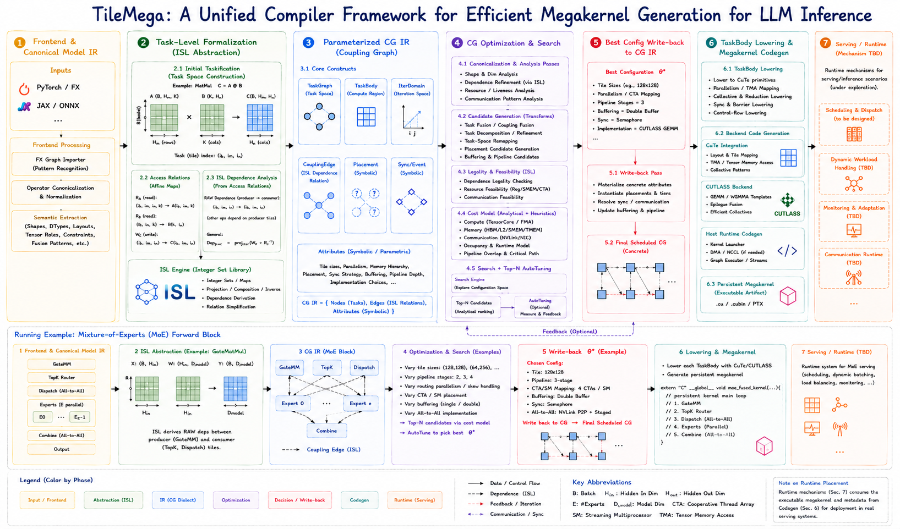

# TileMega

**TileMega** is a compiler framework for automatically constructing tile-level execution graphs and generating persistent megakernels for LLM inference. At its core is a **parameterized Coupling Graph (CG)** that captures task spaces, inter-operator dependencies, synchronization requirements, and execution placement while preserving their dependence on model shapes and task granularity. TileMega uses **ISL-based symbolic** dependence analysis over parameterized task spaces and tensor access relations to derive coupling properties, combines hardware-aware models and search to explore execution configurations, and uses CuTe/CUTLASS to realize high-performance task implementations, ultimately lowering the scheduled CG to a CUDA persistent megakernel.

## Architecture

<p align="center">
  
</p>

## Dependencies

| Dependency | Version | Notes |
| --- | --- | --- |
| C++ compiler | C++17 | |
| CMake | 3.22 or newer | |
| Ninja | any | generator used throughout |
| CUDA Toolkit | provides `nvcc` and `cuobjdump` | required; the recorded `sm_120` build and cluster validation use CUDA 12.8 |
| LLVM/MLIR | pinned commit `23a60f15f2fcafcf67b95b0a035053579958b732` (`23.0.0git`) | **required** — the CG dialect is the mandatory L4-to-L1 contract, so `TILEMEGA_ENABLE_MLIR=OFF` is rejected |
| CUTLASS | `third_party/cutlass` submodule | task interiors and collectives |
| isl | 0.28, pinned by barvinok | **required** — canonical coupling-relation representation and composition |
| polylib | 5.22.9, pinned by barvinok | **required** by barvinok; built with the GMP backend |
| barvinok | 0.41.9 (`third_party/barvinok`) | **required** — parametric cardinalities for wait, fanout, volume, and count |
| GMP / NTL | system development packages | required to link the static polyhedral stack |
| Autotools | autoconf, automake, libtool, pkg-config, m4 | required to bootstrap isl, polylib, and barvinok |
| Python | 3.8 or newer | `lit` driver and the export bridge |
| PyTorch | 2.13.x | needed only by the version-locked `torch.export` bridge and fixture generators, not by the C++ compiler build |

MLIR must come from an **install tree**. A build tree's CMake package bakes
absolute paths to both the build and source directories and breaks as soon as
either moves; an install tree computes its paths relative to the config file and
survives being relocated. `scripts/build_mlir.sh` builds the pinned commit and
installs it; `docs/BUILD_MLIR.md` covers the details, including how to recover a
build tree that has already been moved.

## Build

On Ubuntu or Debian, install the host-side prerequisites first:

```bash
sudo apt-get update
sudo apt-get install -y build-essential git cmake ninja-build \
  python3 autoconf automake libtool libtool-bin pkg-config m4 \
  libgmp-dev libntl-dev
```

Initialize only the submodules used by the build. The nested barvinok URLs use
the `git://` protocol upstream; overriding them with HTTPS avoids failures on
networks that block port 9418. `pet` is intentionally not initialized.

```bash
git submodule update --init third_party/cutlass third_party/barvinok
git -C third_party/barvinok config \
  submodule.isl.url https://repo.or.cz/isl.git
git -C third_party/barvinok config \
  submodule.polylib.url https://repo.or.cz/polylib.git
git -C third_party/barvinok submodule update --init isl polylib
```

Build the pinned polyhedral stack out of tree. The `autogen.sh` steps must run
in their source directories; they may create untracked autotools helper files
inside the polylib submodule, but those generated files must not be committed.

```bash
(cd third_party/barvinok/isl && ./autogen.sh)
mkdir -p build-isl
(cd build-isl && ../third_party/barvinok/isl/configure \
  --with-int=gmp --enable-shared=no --enable-static=yes --with-pic \
  CFLAGS="-O2 -fPIC" CXXFLAGS="-O2 -fPIC" && make -j"$(nproc)")

(cd third_party/barvinok/polylib && ./autogen.sh)
mkdir -p build-polylib
(cd build-polylib && ../third_party/barvinok/polylib/configure \
  --with-libgmp=/usr --enable-shared=no --enable-static=yes --with-pic \
  CFLAGS="-O2 -fPIC" && make -j"$(nproc)")

(cd third_party/barvinok && ./autogen.sh)
mkdir -p build-barvinok
(cd build-barvinok && ../third_party/barvinok/configure \
  --with-isl=build --with-isl-builddir=../build-isl \
  --with-polylib=build --with-polylib-builddir=../build-polylib \
  --with-pet=no --with-gmp=system \
  --enable-shared=no --enable-static=yes --with-pic \
  CFLAGS="-O2 -fPIC" CXXFLAGS="-O2 -fPIC" && make -j"$(nproc)")
```

Build and install the pinned LLVM/MLIR once, then configure TileMega against
that relocatable install tree. Replace `/path/to/prefix` with a persistent
absolute path. Select the deployment architecture explicitly for a portable or
cross-compiled build; leave it as `auto` only for a native build.

```bash
# Build and install the pinned LLVM/MLIR (once).
scripts/build_mlir.sh /path/to/prefix

cmake -S . -B build -G Ninja \
  -DMLIR_DIR=/path/to/prefix/lib/cmake/mlir \
  -DTILEMEGA_TARGET_ARCH=auto \
  -DTILEMEGA_ENABLE_MLIR=ON \
  -DTILEMEGA_ENABLE_ISL=ON
cmake --build build --parallel
ctest --test-dir build --output-on-failure
```

The three polyhedral build directories default to `build-isl`,
`build-polylib`, and `build-barvinok`. Relocated builds can be supplied with
`-DTILEMEGA_ISL_BUILD_DIR=...`, `-DTILEMEGA_POLYLIB_BUILD_DIR=...`, and
`-DTILEMEGA_BARVINOK_BUILD_DIR=...`. See `docs/DEPENDENCIES.md` for the
validated versions, static-link order, and provenance.

CMake options:

| Option | Default | Meaning |
| --- | --- | --- |
| `TILEMEGA_BUILD_TESTS` | `ON` | unit tests and the CG dialect `lit` suite |
| `TILEMEGA_BUILD_VERIFY` | `ON` | verification experiments, including `crosscompile-matrix` |
| `TILEMEGA_ENABLE_MLIR` | `ON` | required; `OFF` is rejected with an error |
| `TILEMEGA_ENABLE_ISL` | `ON` | required; `OFF` is rejected with an error |
| `TILEMEGA_TARGET_ARCH` | `auto` | `auto`, `sm_80`, `sm_89`, `sm_90`, `sm_120` |
| `TILEMEGA_TARGET_CONFIG` | — | path to a target JSON, overriding `TILEMEGA_TARGET_ARCH` |
| `TILEMEGA_LIT_DRIVER` | derived | path to `lit.py`; needed only when `LLVMConfig` does not export `LLVM_BUILD_MAIN_SRC_DIR` |

Additional targets:

```bash
ninja -C build check-cg-lit           # CG dialect parse/verify/print tests
ninja -C build check-policy           # rejects __CUDA_ARCH__ outside
                                      # ArchDispatch.h, sm-version comparisons
                                      # and hardware resource literals
ninja -C build crosscompile-matrix    # compile one architecture-neutral source
                                      # for sm_80/89/90/120 and record the
                                      # ptxas resource matrix
```

`crosscompile-matrix` requires `TILEMEGA_BUILD_VERIFY=ON`, which is the default;
it will not exist as a target if verification was configured off.

Generating a megakernel from a Coupling Graph:

```bash
# torch.export archive -> stable export JSON
python3 python/tilemega/export_bridge.py model.pt2 --out export.json

# stable export JSON -> Coupling Graph dialect (printed on stdout)
build/tools/tilemega-import export.json > cg.mlir

# parse, verify and round-trip the dialect (a standard mlir-opt driver)
build/tools/tilemega-opt cg.mlir

# Coupling Graph -> generated CUDA -> shared object
build/tools/tilemega-compile cg.mlir out.so
```

`tilemega-compile` accepts either a `.mlir` Coupling Graph or the stable export
JSON directly. Passing a `.cu` output writes only the generated CUDA; passing a
`.so` writes the CUDA alongside it as `out.so.cu` and then invokes `nvcc`
(honouring `CUDACXX`, defaulting to `/usr/local/cuda/bin/nvcc`).
