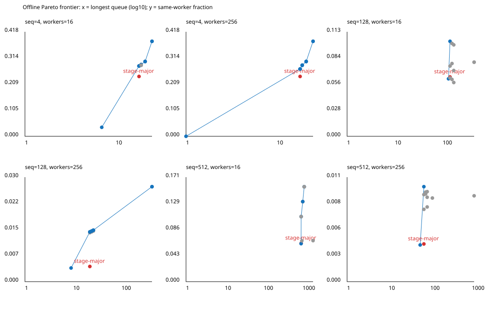

# Task 耦合驱动的离线 isl 调度探针

## 本轮 T4.1：band 感知映射

✅ `raw_mappings/` 重新运行六个实例，四种映射均满足 C 的字典序合法性及
C + worker 队列无环。对照保留 stage-major 和原仿射序号取模。
band_tiling 选择 schedule tree 最外层 permutable/coincident band 的轴，
按 workers 切连续坐标区间；wavefront 以时间第一维分波、第二维分 worker。
缺少可用 parallel band 时拒绝，不自动改回取模。所有 worker 内仍保持合法仿射时间顺序。

下表是同 worker 边比例；跨 worker 比例恰为 1 减该值，二者不是两份独立证据。
这里枚举了完整有限 C，不以抽样显著性检验替代精确计数。

| seq/workers | stage-major | 取模 | band tiling | wavefront |
|---|---:|---:|---:|---:|
| 4/16 | .239521 | .035928 | .380240 | .380240 |
| 128/16 | .063959 | .062008 | .079898 | .079898 |
| 512/16 | .062981 | .062344 | .067176 | .067357 |
| 4/256 | .239521 | 0 | .380240 | .380240 |
| 128/256 | .004301 | .003867 | .026898 | .026898 |
| 512/256 | .004000 | .003896 | .008875 | .009112 |

完整 slot min/p50/p95/max、跨度直方图、跨 worker 边数及使用 worker 数见原始输出。
改善 locality **不等于**改善负载均衡：seq=128、workers=256 时 band 的最长队列
425，对照 22；seq=512、workers=16 时 wavefront 最长队列 1848，对照 913。
此时 wavefront 的 slot 距离为 −1033/−61/1010/1808，对照 −4/383/677/772。
不能把同 worker 边更多直接写成省掉多少 fence 或降低多少运行时间。

⚠️ T4.1 的 locality 条件得到正结果，T4.2 尚未完成；当前仍是 18 算子的分析图，
并未替换完整生成模型的 BuildVariantSchedule、split rewrite 或队列物化。
不存在本轮新 placement 的 GPU 正确性/性能验收结论。全驻留安全条件仍成立，
不将 slot 距离冒充超驻留 I3 的启动序证明。

以下保留上一轮原始探针的范围与结果，避免覆盖负结果。

✅ 在本探针的六个有限实例上，isl 能求得满足 task 级 C 的合法调度；加入 worker 队列顺序后均无环。**这不是生产调度器接入，也不是超驻留 grid 的 I3 证明。**

## 范围与方法

代码：`tools/tilemega-affine-probe.cpp:107` 构造 C，`:136` 同时设 validity/proximity，`:150` 检查每条生产者→消费者边严格按字典序递增，`:169` 构造现有 ListScheduler 的 stage-major 对照。队列边与 C 合并后做拓扑检查。

使用 ReferenceModels 的一个 Llama decoder layer：H=512、I=1024、4 query heads、2 KV heads、tile=128、past=3。它是 18 算子的分析图，**不是生成路径的 30-stage 完整模型**。固定 seq 后实例化真实 task 域和 C，不用人工构造的依赖替代 C。

仿射时间按字典序枚举（同时间按 stage 优先级、坐标确定性破平局），再以枚举序号取模得到 worker，以每 worker 的序号得到 slot。这个有限域展开不等于参数化的仿射 `(worker, slot)` 代码生成；本轮没有改 ListScheduler、BuildVariantSchedule 或队列物化。

## 结果

所有调度映射均为 6 维；seq=4/128/512 分别有 4/3/6 个 band。各 band 的 depth、members、permutable 和完整 schedule tree 见 `raw/s*_w*.txt`。

下表为 C 上 `consumer.slot - producer.slot` 的 min / p50 / p95 / max。不同 worker 的 slot 不是同一个时钟，负值本身不代表违反依赖。

| seq | workers | tasks / C edges | stage-major | isl + 展开 |
|---:|---:|---:|---|---|
| 4 | 16 | 104 / 334 | -8 / 1 / 8 / 10 | 0 / 1 / 3 / 3 |
| 128 | 16 | 2104 / 135774 | -8 / 48 / 82 / 101 | 0 / 63 / 111 / 128 |
| 512 | 16 | 14560 / 2128248 | -4 / 383 / 677 / 772 | 0 / 446 / 797 / 896 |
| 4 | 256 | 104 / 334 | -8 / 1 / 8 / 10 | 0 / 0 / 0 / 0 |
| 128 | 256 | 2104 / 135774 | -8 / 3 / 5 / 11 | 0 / 4 / 7 / 8 |
| 512 | 256 | 14560 / 2128248 | -8 / 24 / 42 / 53 | 0 / 28 / 50 / 56 |

原始输出还保留逐跨度频数，而不只保留分位数。proximity=C 的目标不保证取模后 slot 距离变小：例如 seq=512、workers=16 的最大距离反而从 772 增为 896。❌ “交给 isl 就必然改善 locality” 不受本数据支持。

## I3 与限制

resident_limit=256 来自本轮参考 kernel 的 `E2E_RESOURCE grid=256`（128 SM、每 SM 2 CTA），不是仅以硬件最大 CTA 数代替 kernel occupancy。探针不新增 GPU kernel，也不测性能。

✅ 六例均 `workers <= resident_limit`，且 C + worker 队列无环，因此采用全驻留的安全条件。固定有限域的跨度有界。

⚠️ 没有证明随 seq 增长的统一界，也没有证明 `grid > resident_limit` 下的启动序可执行性。slot 距离不能直接当作 I3 的 CTA 启动序跨度；尤其 seq=512、workers=16 两种顺序的 slot 最大距离都超过 256，但这不推翻全驻留安全条件。输出明确标记 `overresident_proven=0`。

## 弯路与修正

1. C 的窗口表达包含 past 前缀、部分 tile 外的坐标。先与实际生产者和消费者 task 域求交，再提交 validity；这是域语义的精确限制，不是丢弃有效边。
2. `isl_schedule_get_map` 给出的扩展映射在原 task 域之外也有定义，第一次直接枚举报无界域。修正为与原 task 域求交，再枚举；并检查 task 数量、唯一性与依赖合法性。
3. 本例没有触发参数化除数平台限制，因为参数已经固定。不能由此声称参数化仿射映射的问题已解决。

复现：`RESIDENT_LIMIT=256 WORKERS=16 docs/experiments/AFFINE_PROBE/run.sh`，再将 WORKERS 改为 256。使用其他 kernel 时必须重新取得其 resident_limit。
# T1–T5 update: balanced mappings (baseline c8be09e)

✅ `run_balanced.py` runs all six existing finite reference instances, four
old mappings and nine new variants: affine/modulo, band, wavefront, each
with queue caps floor(1.0/1.1/1.2 × stage-major longest queue).
`tools/tilemega-affine-probe.cpp:233` assigns in the legal affine order,
maximizes already-assigned producer affinity under the cap, then breaks ties
by queue length and the original mapping. This is an offline greedy mapping,
not a proof of globally optimal placement. No generator or kernel changed.

Every instance has a Pareto point that strictly improves locality with no
increase in longest queue (stronger than the requested 1.2× allowance):

| seq/workers | Selected variant | Longest queue, old → new | Same-worker edges, old → new | Same-worker fraction, old → new |
|---|---|---:|---:|---:|
| 4/16 | affine_balanced_100 | 18 → 18 | 80 → 94 | .239521 → .281437 |
| 4/256 | affine_balanced_100 | 18 → 18 | 80 → 90 | .239521 → .269461 |
| 128/16 | affine_balanced_100 | 142 → 142 | 8684 → 13904 | .063959 → .102405 |
| 128/256 | band_tiling_balanced_100 | 22 → 22 | 584 → 1913 | .004301 → .014090 |
| 512/16 | band_tiling_balanced_100 | 913 → 913 | 134040 → 227352 | .062981 → .106826 |
| 512/256 | band_tiling_balanced_100 | 70 → 70 | 8514 → 21453 | .004000 → .010080 |

All 78 C+queue graphs are acyclic; all six invocations report
`ISL_CONTEXT remaining=0`. This is CPU graph validation, **not** a 50-process
GPU correctness claim. Full min/p50/p95/max slot spans, forward worker span,
fractions, exact counts, queue caps, Pareto flags and gate flags are in
[`balanced/mappings.tsv`](balanced/mappings.tsv). Negative slot spans are
retained: slots on different workers are not a single temporal clock.

The plot uses a log10 queue axis, gray candidate points, blue nondominated
points, and red stage-major. The three heuristic families can coincide.
Cross-worker and same-worker fractions are complements, not independent
measurements. Looser caps need not help this greedy algorithm: e.g. 512/256
band locality falls from .010080 at cap70 to .008957 at cap84.

I3 qualification: workers are 16 or 256 and supplied resident_limit=256;
these finite experiments use the fully resident sufficient condition.
512/16 still has slot spans above 256. The probe explicitly reports
`overresident_proven=0`; no parameter-domain or overresident proof follows
from these finite samples. Same-worker edge counts also do not prove a
runtime fence can be removed when another consumer is on a different worker.

⚠️ T3.1's offline gate passes, but T3.2–T3.5 remain unimplemented. Production
logical-task → stage and split-rewrite projection must be exact and the T1
event-price units/domain issue remains open (`../EVENT_COST/result.md`).
No runtime speedup or model price difference is inferred from this table.
The historical negative results below are preserved.

---
