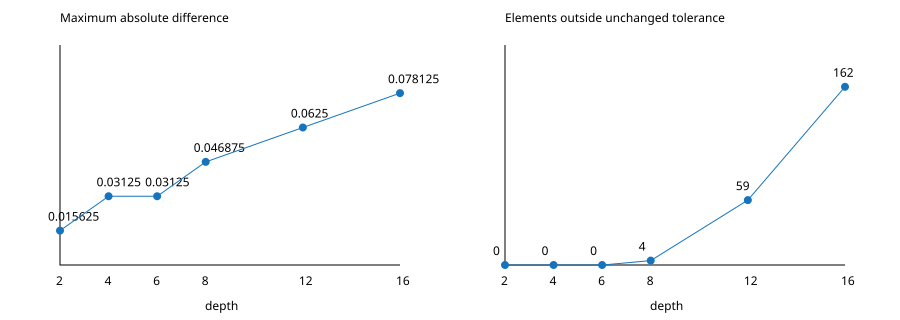

# T4.1 / T4.2: controlled depth and BF16 noise floor

✅ RTX 4090, BF16, **300 fresh processes**: depths 2/4/6/8/12/16,
50 per depth. This is a diagnostic of an already failing criterion, not a
claim of 300 numerical passes. No runtime arithmetic or tolerance changed.

## Controlled inputs and reproduction

`export_real.py:62` constructs the same 16-layer weight stream before taking
each prefix. Hidden=2048, intermediate=8192, heads=32, KV heads=8, seq=4,
past=3, seed=20260906, and `OWNERSHIP/plan_structured.json` are fixed.
`run_depth.py:79` checks SHA256 equality of **every common input and parameter
file**, not just the random seed. Hashes, commands, all six ptxas logs and
300 process logs are in `depth_results/`; model binaries/tensors are ignored
regenerable artifacts in `depth_work/`.

```sh
python3 docs/experiments/REALMODEL/run_depth.py
python3 docs/experiments/REALMODEL/summarize_depth.py
python3 docs/experiments/REALMODEL/compare_golden_threads.py
```

Exports pin OMP/MKL threads to 8 before collecting results. Golden uses
PyTorch 2.14.0+cpu, not CUDA PyTorch. `export_real.py:160` deep-copies the
original eager BF16-rounded model and widens it and the same BF16-rounded
inputs to FP32. It does **not** build independently randomized FP32 weights,
nor convert an exported module whose graph retains explicit BF16 casts.
Consequently the FP32 comparison isolates arithmetic after common input and
weight rounding; it is not a comparison to unquantized original weights.

Each round rotates the depth order. GPU launches use warmup=5/repeat=11;
timings are diagnostic columns, not a 25-round paired performance claim.

## Depth curve

| Depth | Fixed-criterion passes | Mismatched elements | max_abs | max_rel |
|---:|---:|---:|---:|---:|
| 2 | 50/50 | 0 | .015625 | 3.2 |
| 4 | 50/50 | 0 | .03125 | 2929.6875 |
| 6 | 50/50 | 0 | .03125 | 2929.6875 |
| 8 | 0/50 | 4 | .046875 | 6835.9375 |
| 12 | 0/50 | 59 | .0625 | 3906.25 |
| 16 | 0/50 | 162 | .078125 | 10742.188 |

All entries are identical across the 50 processes at that depth. The
unchanged harness compares all outputs, including KV. Large max_rel values
occur near zero; they are not the mixed absolute/relative acceptance rule.

✅ L0.5/L1/L2 hashes agree in **300/300** processes. Their comparisons and
the harness's second-iteration comparison report zero differences in
300/300. `summarize_depth.py:15` independently checks every log, and checks
all first-process output tensors (TileMega, PyTorch BF16, PyTorch FP32) are
finite; the repeated hashes establish that the compared levels keep those
same outputs. No new claim of reachable cross-iteration ABA follows.



The decision rule was smooth growth versus a qualitative discontinuity.
max_abs grows monotonically with a plateau; final-hidden L2 errors below
grow smoothly. Depth 8 has four threshold crossings, not a sudden jump to
hundreds. This **supports accumulation**, without proving that every shared
implementation defect is impossible or isolating one particular reduction.
Threshold-crossing counts alone need not grow linearly with depth.

## Common-FP32 noise floor at depth 16

These norms use the final hidden output only (8192 elements), unlike the
all-output mismatch table. Full depth-by-depth values are in `noise.tsv`.

| Comparison | L2 error | Relative L2 | max_abs |
|---|---:|---:|---:|
| PyTorch BF16 vs common FP32 | 1.2649697800 | .00966684724 | .08760690689 |
| TileMega BF16 vs common FP32 | 1.2540005177 | .00958302059 | .08365106583 |
| TileMega BF16 vs PyTorch BF16 | 1.2506947859 | .00955821727 | .078125 |

✅ `k_L2 = 1.2540005177 / 1.2649697800 = 0.9913284393`.
Across depths the corresponding k values are
1.0026783, .9983450, .9955754, .9939276, .9894468, .9913284.
TileMega is on the observed BF16 arithmetic noise scale in this fixture.
⚠️ This is **not** a proposed or adopted k threshold and does not make
the fixed elementwise criterion pass. Phase 5 condition 7 remains open.

## Why this run has 162 rather than historical 198 mismatches

✅ The TileMega depth-16 hash is the historical `621738651f623f5b`.
`compare_golden_threads.py:10` reloads the exact exported BF16 model and
inputs without modifying fixtures, changing only CPU thread count:

| PyTorch CPU threads | Mismatch vs same TileMega output | max_abs |
|---:|---:|---:|
| 8 (controlled sweep) | 162 | .078125 |
| 56 (environment default / historical run) | 198 | .078125 |

The 8-thread golden reproduces the stored tensors bitwise. Switching to 56
changes 33628 all-output BF16 values and reproduces the historical 198.
Evidence: `depth_results/golden_threads.json`. **This is golden reduction
sensitivity, not a TileMega accuracy improvement.** Thread pinning preceded
the sweep; it was not selected to obtain a pass, and depth 16 still fails.

## Detours and limits

- An optional relative `--out` precheck failed before running a GPU model:
  Path.relative_to mixed relative and absolute paths. The path is now
  resolved and logging uses relpath. `depth_probe/runner_error.txt` preserves
  the error; it is not a numerical or synchronization failure. The default
  full sweep was unaffected.
- The driver gained an explicit second-iteration check during its run;
  Python had already loaded its earlier version. The final summarizer
  rechecked **all 300 logs** independently after completion.
- No split-K repair, criterion revision, fusion or production placement was
  implemented by this experiment. The separate original condition-9 scene
  is reported in `condition9_result.md` and must not inherit these passes.
